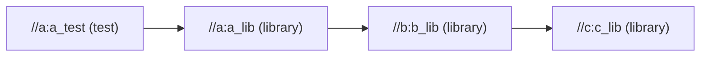
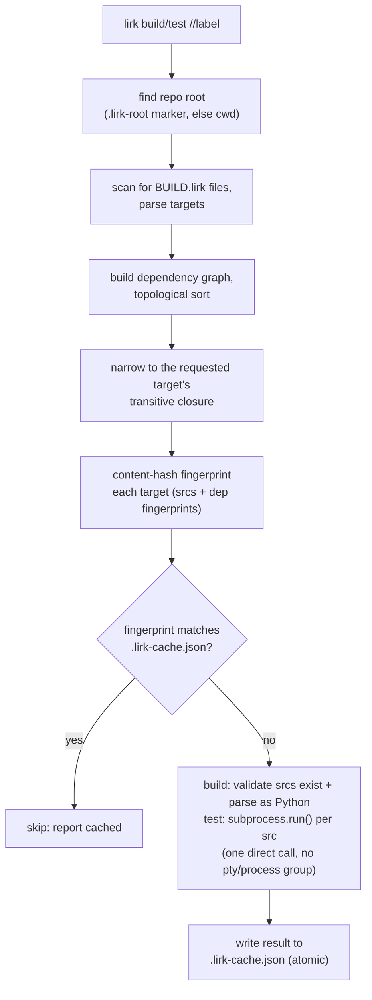

# lirk

A minimal, Bazel/Please-inspired build tool for Python monorepos.

## Why this exists

lirk exists because of a bug we couldn't fully root-cause in
[Please](https://please.build), a Bazel-alike build tool, while using
it on iSH-AOK (a Linux userland running natively on iOS). Build and
test actions would intermittently fail with `signal: hangup` —
non-deterministically, with no problem in the underlying build/test
logic itself. Extensive debugging narrowed the likely cause to
something in Please's process-group/session-control handling around
subprocess execution: it got measurably worse when multiple
invocations shared a session, and in one case the hangup happened
*after* a test binary had already exited successfully, during
Please's own results-capture step. That points at process
lifecycle/session teardown handling, not the commands being run.

Rather than keep chasing a bug in someone else's process model, lirk
takes the opposite approach: use the simplest possible subprocess
invocation model available, and avoid every pattern suspected of
contributing to the original failure. Concretely, lirk:

- Never creates new process groups or sessions for spawned actions
  (no `setsid`, no `os.setpgrp`).
- Never uses pseudo-terminals to spawn build/test commands.
- Runs every action via a single, direct `subprocess.run()` call —
  no manual fork/exec, no custom signal handling.
- Does no process-tree sandboxing or isolation of build actions.
  Trusts the local filesystem directly.
- Never splits test execution into a "run, write results to a file,
  read the file back" sequence. Output and exit code are captured
  directly from the same `subprocess.run()` call that ran the test.
- Runs builds serially in v1. No per-action process groups, no
  parallelism, until serial execution is proven stable.

This is a narrower, more conservative subprocess model than a
general-purpose build tool needs — that's the point. It trades away
sandboxing and parallelism (both easy to add later) in exchange for
a process model simple enough to reason about directly on the
device where the original bug appeared.

## How it works

A repo declares targets in `BUILD.lirk` files (TOML), one per
package directory. Each target is a `library` (a set of `.py` srcs
other targets can depend on) or a `test` (srcs run via `python3 -m
unittest`). Deps are expressed as `//package:name` labels (or
`:name` for a same-package sibling), and can cross package
directories freely:



`lirk build //...` or `lirk test //pkg:name` then runs this
pipeline:



Only successful results are cached, so a failure is retried on the
next run even with an unchanged fingerprint. See "Why this exists"
above for why the test step is one direct `subprocess.run()` call
and nothing fancier.

## Scope (v1)

lirk currently only supports Python targets: `library` and `test`.
No binaries, no genrules, no other languages yet. The goal is to
prove the core approach (dependency graph, incremental builds via
content hashing, direct subprocess execution) works reliably before
expanding scope.

## Using lirk in a repo

A repo with `BUILD.lirk` files should gitignore the artifacts lirk
generates alongside your source:

```
.lirk-cache.json
__pycache__/
*.pyc
```

`.lirk-cache.json` is lirk's incremental-build cache, written at the
repo root; it's local state, not something to commit or share.

### Repo root

lirk needs to know your repo root to scope its target search and
resolve `//`-prefixed labels. By default it uses the current
directory, walking upward for a `.lirk-root` marker file first — drop
an empty `.lirk-root` at your repo's top level and `lirk build`/`lirk
test` will find it correctly even when run from a subdirectory.
Without the marker, lirk silently scopes to whatever directory it was
invoked from, which can make targets outside that subtree look
"missing" rather than out of scope. `--root <path>` overrides
discovery entirely.

## Status

Early development. Not yet self-hosting — lirk is tested with plain
`pytest`/`unittest`, not with itself.

## License

MIT — see [LICENSE](LICENSE).
