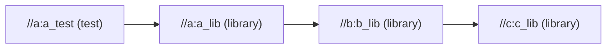
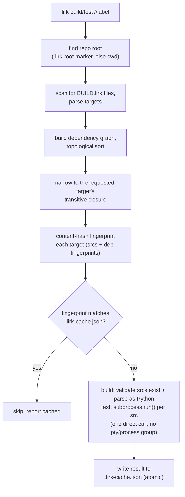

# lirk

A minimal, Bazel/Please-inspired build tool for Python monorepos.

## Why this exists

lirk exists because of a bug we couldn't fully root-cause in
[Please](https://please.build), a Bazel-alike build tool, while using
it on iSH-AOK (a Linux userland running natively on iOS). Build and
test actions would intermittently fail with `signal: hangup` —
non-deterministically, with no problem in the underlying build/test
logic itself. Extensive debugging narrowed the likely cause to
something in Please's process-group/session-control handling around
subprocess execution: it got measurably worse when multiple
invocations shared a session, and in one case the hangup happened
*after* a test binary had already exited successfully, during
Please's own results-capture step. That points at process
lifecycle/session teardown handling, not the commands being run.

Rather than keep chasing a bug in someone else's process model, lirk
takes the opposite approach: use the simplest possible subprocess
invocation model available, and avoid every pattern suspected of
contributing to the original failure. Concretely, lirk:

- Never creates new process groups or sessions for spawned actions
  (no `setsid`, no `os.setpgrp`).
- Never uses pseudo-terminals to spawn build/test commands.
- Runs every action via a single, direct `subprocess.run()` call —
  no manual fork/exec, no custom signal handling.
- Does no process-tree sandboxing or isolation of build actions.
  Trusts the local filesystem directly.
- Never splits test execution into a "run, write results to a file,
  read the file back" sequence. Output and exit code are captured
  directly from the same `subprocess.run()` call that ran the test.
- Runs builds serially in v1. No per-action process groups, no
  parallelism, until serial execution is proven stable — see the v1
  stability criteria under Status below for exactly what that means.

This is a narrower, more conservative subprocess model than a
general-purpose build tool needs — that's the point. It trades away
sandboxing and parallelism (both easy to add later) in exchange for
a process model simple enough to reason about directly on the
device where the original bug appeared.

Separately, real Bazel was ruled out too: on this device the JVM
itself cannot start at all (confirmed independent of Bazel — see
[`docs/KNOWN_ISSUES.md`](docs/KNOWN_ISSUES.md)), so Bazel is
structurally impossible here, not just impractical.

## How it works

A repo declares targets in `BUILD.lirk` files (TOML), one per
package directory. Each target is a `library` (a set of `.py` srcs
other targets can depend on) or a `test` (srcs run via `python3 -m
unittest`). Deps are expressed as `//package:name` labels (or
`:name` for a same-package sibling), and can cross package
directories freely:



`lirk build //...` or `lirk test //pkg:name` then runs this
pipeline:



Only successful results are cached, so a failure is retried on the
next run even with an unchanged fingerprint. See "Why this exists"
above for why the test step is one direct `subprocess.run()` call
and nothing fancier.

## Installation

lirk isn't published to PyPI yet. Install straight from the git repo
with pip (Python 3.11+, no other dependencies):

```
pip install git+https://github.com/socitt/lirk.git
```

Or clone and install from a local checkout — useful for working on
lirk itself:

```
git clone https://github.com/socitt/lirk.git
cd lirk
pip install .          # or: pip install -e .   (editable, for development)
```

Either way installs a `lirk` console script on `PATH`:

```
lirk build //...
lirk test //...
```

## Scope (v1)

lirk currently only supports Python targets: `library` and `test`.
No binaries, no genrules, no other languages yet, and no new
languages or target types will be added until the v1 stability
criteria below are met — this is a hold, not just a "later." The
goal is to prove the core approach (dependency graph, incremental
builds via content hashing, direct subprocess execution) works
reliably before expanding scope.

## Using lirk in a repo

**[docs/getting-started.md](docs/getting-started.md) is the full
walkthrough** — a worked two-package example with real output, how to
convert an existing repo (including the import model, which is where
real repos stumble), the complete command reference, and
troubleshooting keyed to actual error messages. The essentials:

A repo with `BUILD.lirk` files should gitignore the artifacts lirk
generates alongside your source:

```
.lirk-cache.json
__pycache__/
*.pyc
```

`.lirk-cache.json` is lirk's incremental-build cache, written at the
repo root; it's local state, not something to commit or share.

### Repo root

lirk needs to know your repo root to scope its target search and
resolve `//`-prefixed labels. By default it uses the current
directory, walking upward for a `.lirk-root` marker file first — drop
an empty `.lirk-root` at your repo's top level and `lirk build`/`lirk
test` will find it correctly even when run from a subdirectory.
Without the marker, lirk silently scopes to whatever directory it was
invoked from, which can make targets outside that subtree look
"missing" rather than out of scope. `--root <path>` overrides
discovery entirely.

## Status

Early development, not yet stable. All three v1 criteria below now
hold; the tag waits on the last high-priority correctness item (H2 in
[`docs/TASKS.md`](docs/TASKS.md)).

**v1 stability criteria.** Serial execution counts as "proven stable"
(unblocking parallelism work), and lirk is ready to expand scope
beyond `library`/`test` Python targets, once *all three* of the
following hold. This replaces the earlier "proven stable"/"not yet
self-hosting" language with a concrete, non-subjective bar:

1. **Self-hosting.** lirk builds and tests its own source through its
   own `BUILD.lirk` files (`lirk build //...` / `lirk test //...` run
   against this repo), not only via a separately maintained
   `pytest`/`unittest` suite. **Met** (2026-08-02) — `lirk/BUILD.lirk`
   and `tests/BUILD.lirk` describe 13 targets mirroring the real import
   graph. The self-hosted run happens *alongside* `unittest discover`,
   not instead of it: an independent runner is what would catch lirk
   reporting a false green about itself.
2. **Track record on real repos.** At least 200 cumulative `lirk
   build`/`lirk test` invocations across at least 3 distinct real
   (non-fixture, non-lirk) repos, with zero `signal: hangup`
   occurrences and zero cache-correctness bugs (a `cached` result that
   disagrees with what a `--force` fresh run produces). **Met**
   (2026-08-03) — ~187 invocations documented against a games monorepo
   (tallied 2026-07-30), self-hosting as the second repo, and
   `termrery`, a curses orrery built under lirk from its first commit,
   as the third. No `signal: hangup` has ever been observed, in any
   repo, in any session. See [`docs/TASKS.md`](docs/TASKS.md) for the
   caveats. The third repo surfaced a cache-correctness path — an
   undeclared import cached a stale green — which is now detected and
   failed at build time; its narrower sibling remains open as H2.
3. **`docs/KNOWN_ISSUES.md` clear.** No open entries beyond ones
   explicitly marked cosmetic-only. **Met** as of this writing (one
   entry on record, status: Fixed).

Until all three are explicitly confirmed met, no parallelism work
starts and no new languages or target types are added — see Scope
above.

## Contributing

Two docs carry the current state of the project, and both are living
references — overwritten as things change, not appended to:

- [`docs/DESIGN.md`](docs/DESIGN.md) — the architecture as it is now:
  the process-model constraints and why they exist, the target/label
  model, the pipeline, the caching model, and the settled decisions
  that shouldn't be re-opened.
- [`docs/TASKS.md`](docs/TASKS.md) — the backlog: v1 criteria with
  honest status, open bugs, and next actions in priority order.

Read DESIGN.md before changing anything in `lirk/`.

Run both test paths before pushing — they are not redundant:

```sh
python3 -m unittest discover -s tests -t .   # source of truth
python3 -m lirk test //...                   # self-hosted, ~2m45s
```

## License

MIT — see [LICENSE](LICENSE).
