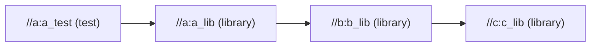
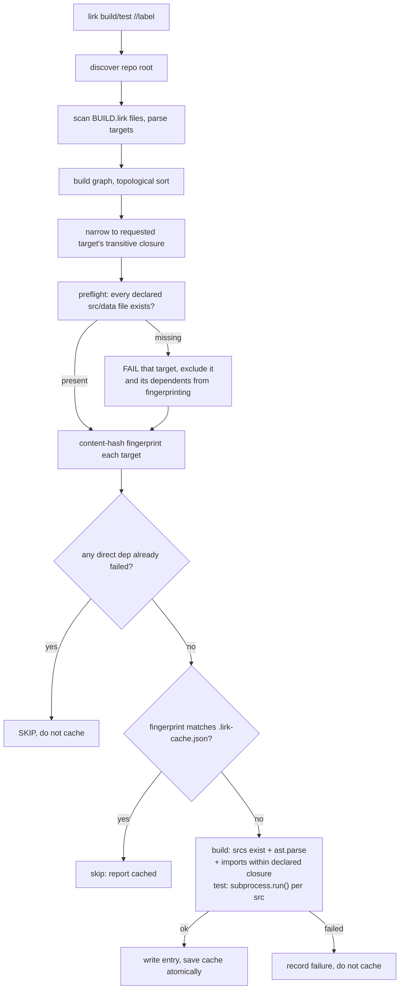

# lirk design

Current-state architecture. This describes lirk **as it is now**, not
how it got here — it is overwritten as the system changes, not
appended to. For open work see [TASKS.md](TASKS.md).

Verified against source at the time of writing: `lirk/cli.py`,
`lirk/graph.py`, `lirk/targets.py`, `lirk/cache.py`, `lirk/actions.py`.

---

## 1. Why lirk exists

lirk is a reaction to a specific, unresolved bug — not a general
dissatisfaction with existing build tools.

**The signal.** While using [Please](https://please.build) (a
Bazel-alike) on iSH-AOK, a Linux userland running natively on iOS,
build and test actions failed intermittently with `signal: hangup`.
Non-deterministic, with nothing wrong in the build/test logic itself.
Two observations narrowed it:

- It got measurably worse when multiple invocations shared a session.
- In one case the hangup fired *after* a test binary had already
  exited successfully — during Please's own results-capture step.

Both point at process lifecycle and session teardown handling, not at
the commands being run.

**Bazel itself was ruled out separately, and for an unrelated
reason.** On this device the JVM cannot start at all: every `java`
invocation crashes in HotSpot's AArch64 assembler
(`guarantee(val < (1ULL << nbits)) failed: Field too big for insn`),
including under `-Xint` and `-Xshare:off`, before any Bazel code runs.
Alpine's musl-native `bazel8` package installs fine and still can't
run. Real Bazel is therefore structurally impossible here, not merely
impractical, and the same applies to any JVM-based tooling. Full
investigation in [KNOWN_ISSUES.md](KNOWN_ISSUES.md), which also links
the upstream report filed against iSH-AOK.

### The decisions that follow from the signal

Rather than chase someone else's process model, lirk adopts the
simplest subprocess invocation available and avoids every pattern
suspected of contributing to the failure. These are hard constraints,
implemented in `lirk/actions.py:run_test`:

| Constraint | Rationale |
|---|---|
| No new process groups or sessions (`os.setpgrp`, `start_new_session`, `setsid`) | The suspected root cause. |
| No pseudo-terminals | Same. |
| Exactly one direct `subprocess.run()` per test src file | Nothing to get out of sync; no manual fork/exec, no custom signal handling. |
| Output and exit code read off that *same* call | Never "run, write results to a file, read it back" — the step Please was inside when one hangup fired. |
| No `shell=True` | Fewer processes in the chain. |
| No process-tree sandboxing or isolation | Trusts the local filesystem directly. |
| Serial execution | No scheduler, no concurrent children, until serial is proven stable. |

**Adding keyword arguments to that single `subprocess.run` call is not
a change to the process model.** `stdin=DEVNULL`, `timeout=`, `env=`,
`cwd=`, and `capture_output=True` are all in use and all fine. The
constraint is on process *topology*, not on call arity.

**If a proposed fix appears to require a process group, a session, a
pty, or a results file, drop the fix — not the constraint.** This has
already been load-bearing once: the test timeout (§5) can only kill
the direct child, not a grandchild, because killing a tree needs a
process group. The partial cleanup was accepted rather than reaching
for `start_new_session`.

This is a narrower, more conservative model than a general-purpose
build tool needs. That is the point: it trades away sandboxing and
parallelism (both easy to add later) for a process model simple enough
to reason about directly on the device where the original bug appeared.

---

## 2. The target and label model

A repo declares targets in `BUILD.lirk` files (TOML), one per package
directory. A **package** is a directory path relative to the repo
root; the root package is `""`.

Two target types exist:

- **`library`** — a set of `.py` srcs other targets can depend on.
- **`test`** — srcs run via `python3 -m unittest`.

```toml
[[target]]
name = "mylib"
type = "library"
srcs = ["mylib.py"]
deps = ["//other/pkg:othertarget", ":sibling"]
data = ["fixture.txt"]
```

Fields (`lirk/targets.py`): `name` (required, non-empty, unique per
file), `type` (required, `library` or `test`), `srcs`, `deps`, `data`
(all default `[]`). Unknown keys are **rejected** at parse time — a
transposed `dpes` used to silently produce a target with no dependency
edges, which meant changes to the real dependency never invalidated it.
A `test` target with **no srcs** is also rejected: the run loop would
otherwise spawn nothing and report a pass.

`data` entries are fingerprinted exactly like `srcs` but never
`ast.parse`d — that's the whole reason the field exists. `srcs` is
restricted to `.py` **by extension, at parse time**, so the split is
self-teaching rather than something you discover later: left to
`ast.parse`, whether a stray text file is caught depends on what it
says — a sentence is a syntax error, `hello` parses fine and sails
through into `srcs`, where every consumer assumes it is importable.
The extension check cannot catch a *mislabelled* file (a PNG named
`.py`), which is why `validate_target` still guards decoding. A file
left undeclared entirely is the silent case: edits to it never
invalidate anything.

A `data` entry may name a **directory**, fingerprinted recursively.
This is not a convenience: a hand-maintained file list is the failure
mode it prevents. Declaring 61 fixture files individually works exactly
until someone adds the 62nd and forgets, at which point the target
reports a cached PASS against inputs that changed — silently, and
indistinguishably from a real pass.

### Labels

Fully qualified: `//package:name`. Relative to the same package:
`:name`. Root package: `//:name`.

`lirk/graph.py:resolve_label` validates shape eagerly — exactly one
`:`, non-empty name part — so a malformed `//a` reports *malformed
label* rather than sending the reader hunting for a target named `//a`
that doesn't exist.



Deps cross package directories freely. The graph is validated at
construction: missing deps, self-deps, and duplicate labels all raise
`GraphError`, and `topological_sort` reports cycles **naming the full
path**, not just "a cycle exists".

### Repo root discovery

`--root <path>` > `.lirk-root` marker in the nearest ancestor of cwd >
cwd itself. The marker is opt-in; without it lirk scopes to the
invocation directory, which makes out-of-scope targets look *missing*
rather than out of scope. The marker was chosen over a "nearest
`BUILD.lirk`" heuristic because a package's own build file is not a
reliable repo-root signal.

**The cwd fallback announces itself, and errors name the root.** The
fallback is legitimate, but it used to be invisible, which meant `//`
silently changed meaning with the directory you happened to be standing
in. From the repo root that is indistinguishable from working; one
directory down it produces `//:cli: dependency '//orrery:orrery' does
not exist` — an error about the dep, when the fault is that the root
moved. So `main` prints a stderr note when no marker is found, and
graph errors and unknown-target errors both print `lirk: repo root is
<path>`. The note is suppressed when a marker *is* found or `--root` is
given, since a warning about an implicit choice is noise once the
choice is explicit. This had confused two separate projects before it
was fixed.

The **downward** scan (`find_build_files`) skips any `BUILD.lirk` under
a dot-prefixed directory, checked relative to root. Without that, a
vendored or nested checkout under `.venv/` gets pulled into an
unrelated repo-wide build.

The dot-prefix rule alone is not enough, because plenty of directories
that hold foreign `BUILD.lirk` files are not dot-prefixed —
`node_modules/`, `vendor/`, and a test-fixture tree. So `.lirk-root`
doubles as repo config, carrying an optional `ignore` list of
root-relative directories to exclude along with their subtrees. An
empty marker still means exactly what it meant before the key existed,
so no existing repo changes behavior.

This is what makes lirk's own self-hosting possible at all:
`tests/fixtures/` contains 24 `BUILD.lirk` files that are *inputs to
lirk's tests*, several deliberately broken (cycles, dangling deps) to
exercise error paths. Scanned as real targets, they make the graph fail
to load before a single target runs.

`ignore` is deliberately separate from `data`: `ignore` decides what is
*scanned*, `data` decides what is *fingerprinted*. A fixture tree is
correctly both — not this repo's targets, but very much its inputs, and
`tests/BUILD.lirk` declares `data = ["fixtures"]` for exactly that
reason.

---

## 3. The pipeline



Three things in that flow are less obvious than they look:

**The preflight exists because of ordering.** `compute_fingerprints`
reads every declared file unconditionally, and it runs *before* the
execution loop. Without a preflight, a missing src surfaces as a raw
`FileNotFoundError` traceback out of the cache layer — while
`validate_target` holds a perfectly good `missing source file(s): ...`
message that the CLI can never reach. So `cli.py:_execute` checks
`missing_files()` across the whole scope first. `_hash_file` also
guards `OSError` into a `CacheError` as defense-in-depth for direct
callers.

The preflight *marks* rather than aborts. A target with missing files
is added to `failed` and reported, and unrelated targets go on to build
normally — one stale filename must not blank the whole repo. What it
must not do is reach `compute_fingerprints`, which reads
`fingerprints[dep]` for every dependency and would `KeyError` on an
excluded one. So the missing-file targets *and their transitive
dependents* are removed from `order` before fingerprinting; because
`order` is topological, a single forward pass propagates that
exclusion. The dependents are still reported, by the ordinary SKIP
branch below.

**Failure propagates as SKIP.** `_execute` keeps a `failed: set[str]`.
Topological order guarantees deps are processed first, so checking one
level — plus adding skipped labels to `failed` too — transitively
covers the whole subtree. A dependent of a broken target prints
`SKIP <label>: dependency <dep> failed`, is not cached, and never
counts as passed. Without this, a test that depends on a
syntactically-broken library but doesn't import it would pass, get
cached, and produce `1/1 tests passed` directly above `lirk: FAILED`.

**Only successes are cached.** A pass may be trusted forward; a
failure must always be retried. This asymmetry is deliberate and
load-bearing.

### Imports are checked against `deps`

Building a target also fails it if a src imports a repo module that is
outside its dependency closure — either owned by a target it doesn't
depend on, or declared by no target at all. Added 2026-08-03; it is
what stops `deps` from being decoration.

The reason it is a correctness check rather than hygiene: targets
execute with the repo root importable (§5), so Python resolves a
cross-package import whether or not the edge is declared. An undeclared
edge is therefore also **missing from the fingerprint** (§4 folds in
dep fingerprints, and only declared ones), so editing the imported
package invalidates nothing. The observable result is a `cached` PASS
that `--force` turns into a FAIL — the same stale-input family as an
undeclared `data` fixture, found the same way, on the third consumer
repo.

Four decisions inside it, none of them free:

- **Against the transitive closure, not direct deps only.** The
  stale-input problem is closed the moment the dependency is folded
  into the fingerprint, which the closure does. Bazel's stricter
  "direct deps only" rule buys no additional correctness here and would
  reject lirk's own BUILD files, which lean on transitive edges
  deliberately.
- **A file no target declares is reported too**, with a different
  message: `imports 'orphan.thing' -- no target declares
  orphan/thing.py`. There is no owning target to name, and that is the
  defect — nobody fingerprints it. The two messages must stay distinct
  because the fixes differ: add a `deps` entry, versus declare the file
  in some target's `srcs`.

  Rejecting was chosen over fingerprinting the file implicitly (the
  alternative considered for TASKS.md H2). Implicit fingerprinting is
  silent and costs adopters nothing, but it makes the graph partly
  implicit, and it needs a transitive walk over undeclared files —
  orphan A importing orphan B means folding in A alone still leaves B
  unfingerprinted. Rejecting gets that transitivity by construction:
  once B must be declared, whatever B imports falls under the rule
  above. It also keeps fingerprinting free of `ast`, which implicit
  folding would require on every run, including fully cached ones.

  The concern that this would reject ordinary repos was measured before
  landing rather than assumed: across `terminal-projects` (66 targets),
  lirk itself (13) and `termrery` (4), **zero** imports resolve to an
  undeclared file. One fixture did — `rootimport_repo`'s empty
  `pkg/__init__.py` — and declaring it is the same thing lirk's own
  `lirk/BUILD.lirk` already does with its `:init` target.

- **Ancestor package inits are still not checked.** `_resolve_module`
  resolves a dotted path to one file and does not also collect the
  `__init__.py` of each package along the way, so `import a.b.c` never
  looks at `a/__init__.py`. An undeclared one there remains an
  unfingerprinted input. Left deliberately: it resolved to nothing
  across all three repos, and collecting ancestors turns one clear
  error into several. See TASKS.md.
- **Resolution mirrors the runner**, not Python's full import system:
  the target's package directory (`sys.path[0]` under `cwd=pkg_dir`)
  then the repo root (`PYTHONPATH`). Anything resolving outside the
  repo — stdlib, site-packages — is not lirk's business. There is no
  `importlib` machinery and nothing is imported to find out; it is
  `ast` plus path existence.
- **The AST is reused, not re-parsed.** `validate_target` already
  parses every src for the syntax check, so the import walk rides on
  the same trees. A second parse would only be a second chance to
  disagree with the first.

`ImportEnv` (the owner index plus the target's allowed labels) is built
by `cli.py` and passed in, so `actions.py` still doesn't import the
graph layer. When it is absent, `validate_target` does the syntax check
only — that path exists for unit tests, and the CLI always supplies
one.

---

## 4. The caching model

`.lirk-cache.json` at the repo root maps a key to a content
fingerprint. Local, gitignored state — not committed, not shared
between machines.

**Key is `"<mode>:<label>"`**, e.g. `build://a:lib` vs `test://a:lib`.
Build and test never share an entry for the same target: `lirk build`
merely validating a test target's files must not count as `lirk test`
having actually run it. This guards a bug that really shipped.

**Fingerprint** (`compute_fingerprints`) is a SHA-256 over, in order:

1. target `name` and `type`
2. `ACTION_VERSION`
3. each `srcs` entry, **sorted**: filename + SHA-256 of contents
4. each `data` entry, sorted: name, then either its SHA-256 (a file)
   or, for a directory, every file beneath it sorted by relative path,
   each contributing that path **and** its SHA-256
5. each dep label, **sorted**: label + that dep's fingerprint

The relative path of each file inside a data directory is hashed, not
just its contents, so adding or removing a file changes the fingerprint
even when nothing was edited. Dot-prefixed and `__pycache__` segments
are excluded: they are generated, and a fixture tree containing Python
accrues `.pyc` files from running the very tests this fingerprint
gates, which would change the input on every run and cache nothing.

Consequences worth stating explicitly:

- **Dep fingerprints are folded in recursively**, so any change
  anywhere in a dependency chain propagates forward and invalidates
  every dependent. Requires `order` to be a topological order.
- **Sorting** means declaration order in `BUILD.lirk` doesn't affect
  the hash, but adding/removing/renaming a src or dep does. Comments
  and formatting in `BUILD.lirk` correctly do not.
- **`ACTION_VERSION`** covers what the fingerprint otherwise can't
  express: what lirk itself *does*. Without it, changing the meaning of
  a successful build leaves every previously-cached target green
  forever. This fired silently twice before the constant existed —
  once when `ast.parse` validation was added, once when the test
  subprocess environment changed. **Bump it in the same commit as any
  change to `validate_target` or `run_test` behavior.** Currently `10`
  — the last bump extended the import check to files no target
  declares, which changes what a passing build means, so caches written
  before it must not be trusted.
- **Content hashing, not mtimes.** Immune to `touch`, to fresh
  checkouts, to clock skew, and to iSH-AOK's questionable time
  accounting (observed reporting `user 24m40s` for a 42s run). A whole
  category of stale-build bug avoided by construction.

**Writes are atomic and incremental.** `save_cache` writes a sibling
`.<pid>.tmp` and `os.replace()`s it, so an interrupted write cannot
leave a truncated file. The PID is in the name so two concurrent runs
cannot write the same temp path and replace each other's half-written
file. That does not make concurrent runs safe — load/save is an
unlocked read-modify-write, so overlapping runs can still lose one
run's entries — but a lost entry costs a redundant rebuild, whereas a
torn temp file is a corrupt cache. Locking properly would mean a lock
file, whose stale-after-crash failure mode is a poor trade on a device
that crashes. `_execute` saves after *every* successful target, not
once at the end — on a device that has crashed mid-session before,
losing a completed 60s run to a Ctrl-C is the same category of problem
the project's doc discipline exists to avoid. Every per-target `print`
uses `flush=True` for the same reason: block-buffered stdout loses a
redirected run's whole progress log on interruption.

**`load_cache` fails open to `{}`** on a missing, corrupt, or
non-dict file. Corrupt cache means rebuild everything. It fails toward
doing more work, never toward a false pass — preserve this direction
through any rework.

`--force` / `--rebuild` / `--rerun` bypasses the cache *check* without
deleting or truncating the cache file.

---

## 5. Executing actions

Both actions live in `lirk/actions.py` and return an `ActionResult`
(`ok`, `message`, `stdout`, `stderr`).

**`validate_target`** — this is v1's entire "build" step. Confirm every
declared `srcs`/`data` file exists, then `ast.parse` each `srcs` file.
No compilation, no bytecode, no artifact output. `SyntaxError` reports
a syntax error; `UnicodeDecodeError`/`ValueError` report *not readable
as Python source* rather than escaping as a traceback.

**`run_test`** — validates first, then one `subprocess.run` per src:

```python
subprocess.run(
    [sys.executable, "-m", "unittest", module],
    cwd=pkg_dir, capture_output=True, text=True, env=env,
    stdin=subprocess.DEVNULL, timeout=TEST_TIMEOUT_SECONDS,
)
```

- **`module` is the src path relative to the package, dotted**
  (`sub/test_nested.py` → `sub.test_nested`), with `cwd` set to the
  package directory. Subdirectories need no `__init__.py`: they import
  as PEP 420 namespace packages. Deriving `Path(src).stem` instead —
  as lirk did through `ACTION_VERSION` 6 — broke subdirectory srcs with
  a bare `ModuleNotFoundError`, and silently collapsed two same-named
  srcs in different subdirectories onto one module.
- **`env` prepends the repo root to `PYTHONPATH`.** Flat sibling
  imports (`from a import greet`) resolve via `cwd` being
  `sys.path[0]`; root-relative imports (`from shared import term`, the
  convention Bazel/Please encourage) resolve via the repo root on
  `PYTHONPATH`. This is the fix for the only production bug lirk has
  ever had.
- **`stdin=DEVNULL`.** Otherwise a test reading stdin blocks forever on
  an interactive terminal — consuming the user's keystrokes, with no
  output because stdout is still buffering. With DEVNULL it gets EOF
  and fails fast. This matters because the primary consumer is a repo
  of interactive terminal games whose tests pipe input into game
  entrypoints.
- **`timeout=600s`**, chosen not to trip the slowest known real target
  (~12s). A timeout reports a clean failure with whatever partial
  output was captured. Known limitation, accepted deliberately: this
  kills only the direct child, so a `main_test.py` that spawned its own
  `main.py` can leave that grandchild running. Killing the tree needs a
  process group. A partially-cleaned timeout beats an unbounded hang.
- **Every src runs even after an earlier one fails** — *including*
  after one times out. Failures accumulate into
  `N of M src files failed: ...`. Stopping at the first failure was
  invisible while every target had one src; with multi-src targets a
  failing `test_moves.py` would hide `test_castling.py` entirely. The
  timeout path returned early for exactly this reason until it was
  fixed: a hung test often does mean the whole target is wedged, but
  that is a guess, and guessing costs every later src's result.
- **A module that runs zero tests fails.** `unittest` exits 5
  (`NO TESTS RAN`) on 3.12+ but 0 on 3.11, which `pyproject.toml` still
  supports, so an exit-code-only check reports a false PASS for a file
  that tests nothing. lirk keys off the `Ran 0 tests` summary line,
  written on every version, and checks it independently of the exit
  code so the reason is named on 3.12 too.

**Test output is passed through raw**, unsummarized and unreformatted.
Two independent assessments identified this as a practical strength.
Resist adding an interpreting layer.

**A failing run does restate which labels failed**, immediately above
the counts (`_print_failures`). This is not the interpreting layer
ruled out above: it reprints labels lirk itself already printed and
touches nothing about the captured output. It exists because the
per-target `FAIL` line scrolls off above a unittest traceback, leaving
a counts-only summary on screen — on a phone terminal, recovering a
label you already saw means scrolling back through the whole dump.
Targets reported `SKIP` are deliberately excluded: they are
consequences of someone else's failure, and listing them buries the
labels worth acting on.

---

## 6. Deliberate scope constraints

**Python only, `library` and `test` only.** No binaries, no genrules,
no other languages. This is a **hold**, not a "later": no new language
or target type is added until the v1 stability criteria in
[TASKS.md](TASKS.md) are met. The goal is to prove the core approach —
dependency graph, content-hash incrementality, direct subprocess
execution — before widening the surface it has to work across.

**Serial only.** No parallelism until serial execution is proven
stable by those same criteria. Parallelism would reintroduce exactly
the concurrent-process-lifecycle surface the original bug lived in.

**Zero runtime dependencies.** Python 3.11+ stdlib only. TOML was
chosen partly for this: `tomllib` ships in the stdlib, where YAML
would mean depending on PyYAML — real friction on this device. A
Python/Starlark-style build file was ruled out because reading target
metadata would mean `exec()`-ing user code or building a restricted-exec
sandbox, which is precisely the execution-model complexity this project
exists to avoid. TOML's `[[target]]` array-of-tables also maps directly
onto "an ordered list of target declarations", and its syntax has
little of YAML's whitespace ambiguity — relevant when typing on an iOS
on-screen keyboard, where a stray space is easy to miss.

**`BUILD.lirk`, not `BUILD.toml`** — visually distinctive when
grepping or `ls`-ing a package directory, mirroring the Bazel/Please
convention if not the syntax.

**No real sandboxing.** Build actions read and write the local
filesystem directly.

### Settled decisions — do not re-open without new evidence

Recorded so a later session doesn't relitigate them:

- **Parallel execution, remote caching, sandboxing, `lirk query`.**
  Deferred repeatedly on evidence, most recently at ~26 targets.
- **`lirk run` / a `binary` target type.** Confirmed off the roadmap.
  The need is fully met by `test` targets that subprocess the
  entrypoint.
- **Mocking `subprocess.run` to speed up the test suite.** The suite
  spawns real interpreters deliberately. Mocking would undercut the one
  thing this tool exists to prove.
- **`srcs` glob syntax.** Dropped after multi-file `library`/`test`
  targets were verified to work without it.
- **A summarizing layer over test output.** See §5.
- **Reducing CLI startup time.** The flat ~2.7–3.2s per-invocation
  overhead is CPython's own import tax for an
  argparse + dataclasses + tomllib + subprocess CLI, paid once per
  process, on a host that is slow at process/import machinery
  generally. Confirmed by profiling: a *fully cached* run spawning zero
  test subprocesses still costs ~2.70s, and `import lirk.cli` alone
  accounts for ~2.56s of it. It doesn't scale with test count. Cutting
  it means hand-rolling replacements for stdlib modules — a bad trade
  at v1. It does mean **new imports are not added to the startup path
  for the sake of a rare flag**: `--version` uses a custom argparse
  action so `importlib.metadata` is imported only when the flag is
  actually passed, rather than on every invocation.

---

## 7. Code map

| File | Responsibility |
|---|---|
| `lirk/targets.py` | `Target` dataclass; parse and validate one `BUILD.lirk` |
| `lirk/graph.py` | Scan repo, resolve labels, build `Graph`, topological sort, transitive closure |
| `lirk/cache.py` | `ACTION_VERSION`, fingerprints, atomic cache load/save, `needs_build` |
| `lirk/actions.py` | `missing_files`, `validate_target`, `run_test` — the only place a subprocess is spawned |
| `lirk/cli.py` | Arg parsing, root discovery, `_execute` loop, summaries, exit codes |
| `bin/lirk` | Path-inserting shim for running from a checkout without installing |

Tests are plain `unittest`, run with
`python3 -m unittest discover -s tests -t .`. Fixtures under
`tests/fixtures/` are miniature repos, each isolating one behavior:

| Fixture | Exercises |
|---|---|
| `sample_repo` | The baseline: linear `a → b → c`, lib + test per package |
| `diamond_repo` | Multiple deps, shared dep reached via two paths, dep-order independence |
| `cycle_repo`, `self_dep_repo`, `missing_dep_repo` | Graph validation errors |
| `root_package_repo` | `BUILD.lirk` at the repo root, `//:name` label form |
| `rootimport_repo` | Root-relative `from pkg.thing import ...` — the PYTHONPATH regression |
| `multisrc_repo` | Multi-src library and test targets; later failures not hidden by earlier ones |
| `data_dep_repo` | `data` field: fingerprinted, not syntax-checked |
| `datadir_repo` | `data` naming a directory: recursive fingerprint, add/remove detection, `__pycache__` exclusion |
| `hang_repo` | Test timeout path, and that a timeout doesn't abandon later srcs |
| `no_tests_repo` | A test module defining no tests fails rather than passing |
| `stdin_repo` | Child does not inherit lirk's stdin |
| `subdir_test_repo`, `stem_collision_repo` | Test srcs in package subdirectories; same-stem srcs don't collide |
| `ignore_repo` | `.lirk-root`'s `ignore` list, covering the named directory and its subtree |
| `failing_test_repo`, `failed_dep_repo` | Failing test vs. failing library with a dependent (SKIP propagation) |
| `syntax_error_repo`, `missing_src_repo`, `binary_src_repo` | Clean per-target failures instead of tracebacks |
| `missing_src_partial_repo` | A missing src fails only its own target, not the whole run |

The suite spawns real interpreters rather than mocking, which is why
it costs ~60s+ on the target device. That is the accepted tradeoff.
When adding a fixture for graph or cache logic rather than execution,
prefer `library` targets so it doesn't pay interpreter startup.
